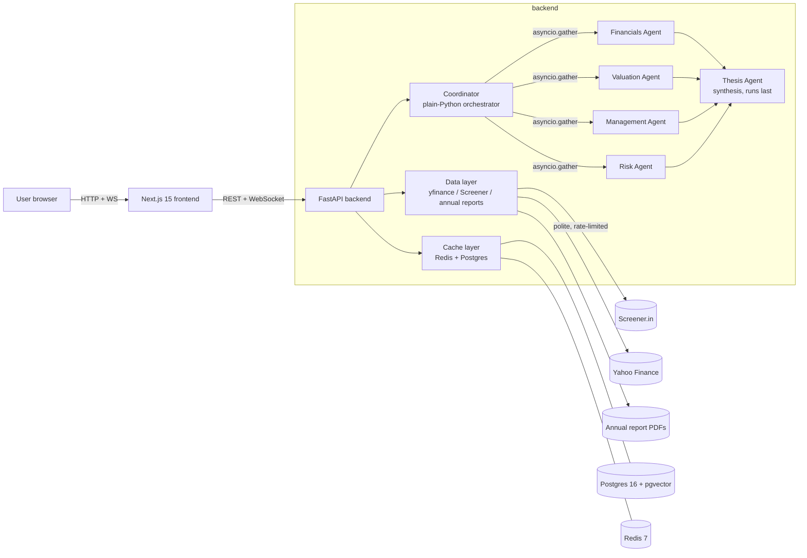

# Architecture

> **Reminder.** This is an educational/engineering demo. Nothing here is investment advice. See [README.md](./README.md#fundamentals-ai) for the full disclaimer.

> **Build status.** Step 1 of the execution plan ships repo scaffolding + docker-compose with `postgres` (pgvector) and `redis` healthchecked. Sections marked _planned_ describe the target architecture and will be filled in as the corresponding build step lands.

---

## High-level shape



---

## Why PydanticAI (and not LangGraph)

The whole agent graph is a `~150-line` async function. Read it like prose:

```python
async def run(ticker: str, depth: Literal["quick", "full"]) -> Report:
    deps = await build_deps(...)
    await emit("agent_started", agent="coordinator", ...)

    results = await asyncio.gather(
        financials_agent.run(prompt(ticker), deps=deps),
        valuation_agent.run(prompt(ticker), deps=deps),
        management_agent.run(prompt(ticker), deps=deps),
        risk_agent.run(prompt(ticker), deps=deps),
        return_exceptions=True,
    )
    fin, val, mgmt, rsk = handle_partial_failures(results)

    thesis = await thesis_agent.run(synthesis_prompt(fin, val, mgmt, rsk), deps=deps)
    return assemble_report(fin, val, mgmt, rsk, thesis)
```

That's it. The orchestration logic is **just Python you can step through in a debugger**. No graph DSL, no nodes/edges to declare, no separate execution engine.

PydanticAI's contribution is the per-agent contract: typed `deps_type`, typed `result_type`, `@agent.tool` decorators that bind validated tool I/O, and a `TestModel` that makes unit-testing each agent independently a one-liner.

---

## The agents (planned)

| Agent | Input | Tools | Output (Pydantic) |
|---|---|---|---|
| Coordinator (not a PydanticAI agent — plain Python) | ticker, depth | — | run record + streamed events |
| Financials | ticker | `yfinance_fetch_financials`, `screener_fetch_financials`, `compute_ratios` | `FinancialsReport` |
| Valuation | ticker | `screener_fetch_valuation`, `peers_fetch`, `compute_historical_medians` | `ValuationReport` |
| Management | ticker | `annual_report_extract_md_a`, `annual_report_extract_governance` | `ManagementReport` |
| Risk | ticker | `annual_report_extract_risks`, `screener_fetch_concerns` | `RiskReport` |
| Thesis (synthesis) | prior 4 reports | _none_ — pure synthesis | `InvestmentThesis` (bull / bear / neutral, every point cites a prior agent) |

Partial-failure behaviour: if any of the four parallel agents raises, the orchestrator catches it, marks that section `unavailable` in the final report, and continues. The Thesis agent is told which sections are missing.

---

## Data layer (planned)

- `yfinance_client.py` — async wrapper around yfinance, cached 6h.
- `screener_scraper.py` — httpx + selectolax. Rate-limited to 1 req / 3s. Identifying User-Agent. Respects robots.txt. Cached 24h. Degrades gracefully on error.
- `annual_report.py` — downloads PDFs once (indefinite cache), extracts MD&A / governance / risks via pypdf for fast text and pdfplumber for layout-aware section finding.
- `peers.py` — sector/industry peer lookup.

---

## Caching (planned)

Two-layer:

1. **Redis** — short-term: in-flight request dedup, per-host scraper rate-limit windows, hot lookups.
2. **Postgres + pgvector** — persistent: scraped Screener pages, parsed annual-report sections (with embeddings for similarity lookup), full agent reports per ticker.

TTLs are documented in [README.md → Caching strategy](./README.md#caching-strategy).

---

## API surface (planned)

| Method | Path | Purpose |
|---|---|---|
| `POST` | `/analyze` | Body: `{ "ticker": "RELIANCE", "depth": "quick"\|"full" }` → `{ run_id, websocket_url }` |
| `WS`   | `/ws/runs/{run_id}` | Streams `agent_started` / `tool_called` / `tool_completed` / `agent_completed` / `partial_result` / `run_completed` / `error` |
| `GET`  | `/runs/{run_id}` | Final structured report |
| `GET`  | `/runs/{run_id}/report.json` | Raw JSON for download |
| `GET`  | `/tickers/search?q=...` | Autocomplete |
| `GET`  | `/health`, `/ready` | Liveness / readiness |

Every API response carries a top-level `disclaimer` field — mandatory.

---

## Frontend (planned)

Three pages:

- `/` — search hero with ticker autocomplete and recent analyses.
- `/analyze/[ticker]` — **the showpiece.** A live "watch the agents think" page driven by WebSocket events: a row per agent (queued → running with current tool → completed/failed), result cards animating in as each agent finishes, the bull/bear synthesis card unfolding once the Thesis agent completes.
- `/report/[run_id]` — clean, static, shareable report (no animations).
- `/about` — project explanation + permanent disclaimer.

Animation rules are strict: 150–300ms ease-out, opacity + small translate only, no scale/rotation/bounce/spin/confetti, `prefers-reduced-motion` respected. Loading skeletons are sized to the eventual content (no layout shift).

---

## Build status — execution checkpoints

- [x] **Step 1.** Repo scaffolding; docker-compose with postgres + redis healthy.
- [x] **Step 2.** Backend skeleton: FastAPI `/health` 200, alembic migrations apply on cold start.
- [x] **Step 3.** Data layer: async `yfinance_client` + Redis-backed Pydantic-typed cache; Screener stub (replaced for real in step 6).
- [x] **Step 4.** **Mandatory checkpoint cleared** — Financials Agent end-to-end on RELIANCE / INFY / HDFCBANK with evidence-linked findings (Anthropic Claude).
- [x] **Step 5.** Valuation Agent — current multiples + per-FY historical P/E and P/B + median series.
- [x] **Step 6.** Management Agent + annual-report PDF parsing (Screener-driven discovery → BSE/NSE PDF download → pypdf section extraction with per-type boundary rules).
- [x] **Step 7.** Risk Agent — categorised, severity-tagged risks anchored to AR quotes or Screener concern bullets.
- [x] **Step 8.** Orchestrator: `asyncio.gather` with partial-failure handling; `POST /analyze` (background) + `GET /runs/{run_id}` + Postgres persistence.
- [x] **Step 9.** Thesis Agent — synthesis-only, citation-mandated bull/bear/neutral. *Live mandatory checkpoint pending: needs Docker up + a working `ANTHROPIC_API_KEY` or `DEEPINFRA_API_KEY`.*
- [x] **Step 10.** WebSocket streaming via in-process EventBus + history replay for late subscribers.
- [x] **Step 11.** Next.js 15 App Router frontend: home with ticker autocomplete + `/analyze/[ticker]` live streaming page (the showpiece). *Live mandatory checkpoint pending the same key/Docker as step 9.*
- [x] **Step 12.** `/report/[run_id]` shareable page with Recharts visualisations + Open Graph metadata.
- [x] **Step 13.** Polish: next-themes dark mode, loading skeletons sized to final content, error/not-found pages, responsive grid, `prefers-reduced-motion` honoured.
- [x] **Step 14.** README + ARCHITECTURE.md updated to reflect the full build. Screenshots TBD on first live run.
- [ ] Step 15. Fresh-clone smoke test (`docker compose up` from clean state) — pending Docker daemon up.
